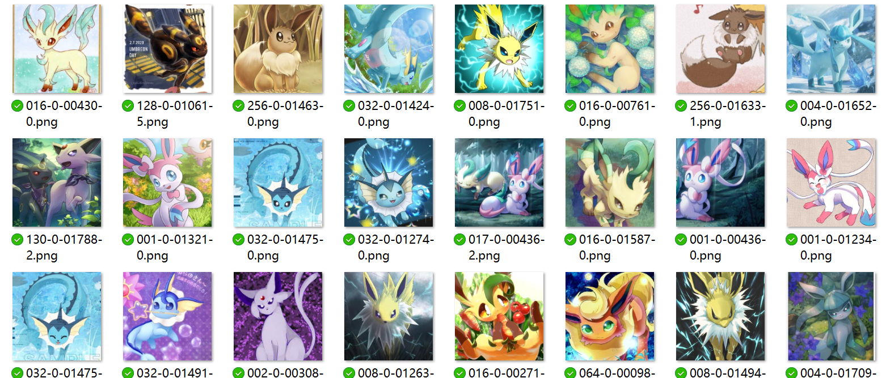

# EeveeNet
这里存放着EeveeNet的~~代码~~和训练集



## 数据集使用说明
- ImageSource文件夹内有3个压缩文件 ```train_data00.zip train_data01.zip test_data.zip```分别是第一期的训练集、第二期的训练集以及测试集。 

- 压缩包内根目录的```Path_List**.txt```记录各文件夹的相对目录，数据集就在这些目录内
> ```train_data01```内有两个Path List，分别是包括数据增强```PathList_Manga_Enhanced.txt```和不包括数据增强```PathList_Manga.txt``` 选择一个就行了

- 对于数据，文件名为```aaa-****.png```,最前面三个数字aaa即是它的标签（python可以通过```int(filename.split('-')[0]```)获得）。

- 数字是按照每种伊布是否存在，将它们的二进制表示按位或起来得到的。例如的文件名为```130-0-01873-2.png```，130 = 128 or 2，其中按照下表，128代表月伊布，2代表日伊布，则该图片明显可辨识出月伊布和日伊布。

## train_data00以及train_data01样本量（不包括数据增强）
|种类|伊布|月伊布|火伊布|水伊布|叶伊布|雷伊布|冰伊布|日伊布|仙子伊布|
|:----:|:----:|:----:|:----:|:----:|:----:|:----:|:----:|:----:|:----:|
|二进制表示|256|128|64|32|16|8|4|2|1|
|数量|1590|1391|810|831|864|902|1079|1242|1687|

